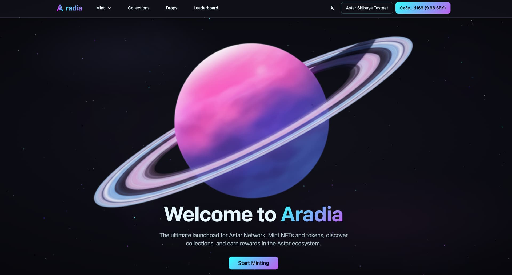
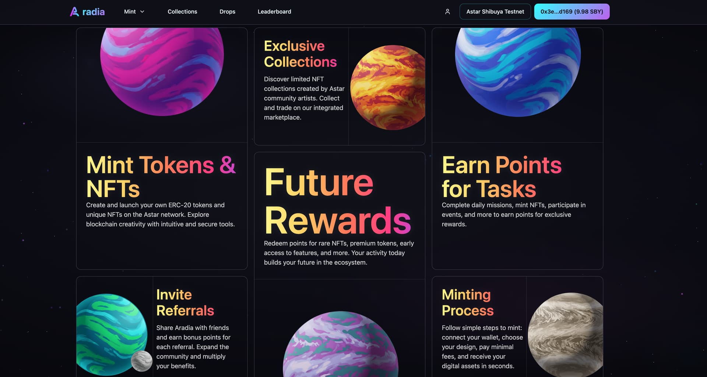
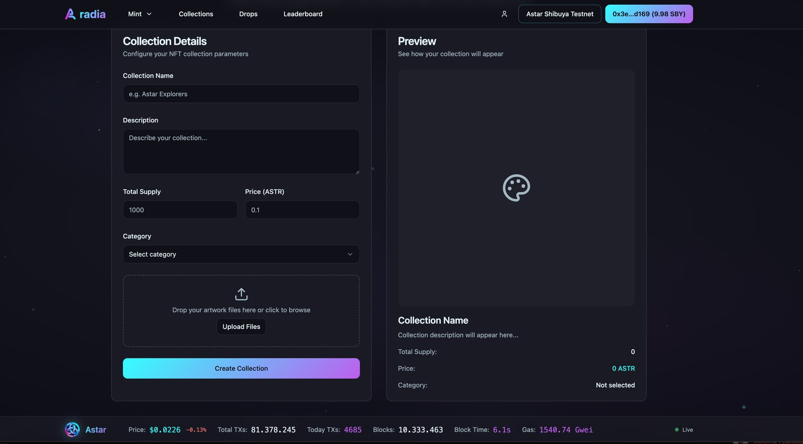

# Aradia Launchpad

Aradia Launchpad is an all-in-one platform designed to empower creators, communities, and projects to thrive within the Astar and Soneium ecosystems.

You can check Aradia DEMO here: [aradia.app](https://aradia.app)  
*(DEMO is running on Astar Shibuya Testnet)*

## Platform Screenshots

## Project Overview

With our Launchpad, users will be able to:

- Create and mint NFTs or entire NFT collections.
- Launch and manage NFT Drops.
- Trade NFTs within a EVM & Native marketplace.
- Climb the Leaderboard of creators and traders.
- Create and mint their own tokens directly from the platform.

Our mission is to provide a seamless, secure, and gamified environment that fosters creativity, liquidity, and adoption of Web3 assets.

## Alignment with Astar & Soneium

The Launchpad is fully aligned with Astar and Soneium's vision of building interoperable, developer-friendly, and community-driven ecosystems.

- Boosted on-chain activity and transaction volume (NFTs + tokens).
- Attraction of creators and Web3 projects seeking a scalable, user-friendly environment.
- Expansion of the dApp ecosystem, by serving as the launch foundation for new projects.
- Enhanced user engagement through gamification and Leaderboard incentives.

## Technical Details

The Launchpad will integrate:

- **NFT Module**: NFT and collection creation, minting, and management.
- **NFT Drops**: Programmable drops with whitelist and dynamic distribution.
- **Token Factory**: One-click ERC-20 creation with customizable parameters.
- **EVM & Native Marketplace**: P2P NFT trading with automated royalties for creators.
- **Leaderboard**: Dynamic rankings based on participation and trading volume.

## Roadmap

### Phase 1 (Month 1): Testnet Launch (Astar)
Features: NFT minting, token creation, basic UI/UX.  

### Phase 2 (Month 2): Mainnet Launch (Astar)
Features: NFT Drops, advanced token parameters.  

### Phase 3 (Month 3): Gamification & Partnerships
Features: Expanded Leaderboard rewards, partnerships with artists & gaming projects.  

### Phase 4 (Month 4): Marketplace Expansion
Features: Full NFT marketplace integration, flagship collection onboarding.  

### Phase 5 (Month 5–6): Cross-Chain Deployment (Soneium)
Features: Cross-chain NFT & token bridge integrations.  

We plan to deploy on PolkaVM in the near future too. This will bring more users and activity to the Launchpad.

## Community Engagement Strategy

We will drive community adoption with:

- Workshops & AMAs → "Mint your first NFT/Token in minutes."
- Exclusive rewards → NFTs & Leaderboard points for active members.
- Collaborations → With artists, gaming projects, and NFT collections.
- Governance rewards → Special NFTs for staking and participation.

## Additional Incentives

Ambassador NFTs for early adopters and stakers, offering:

- Priority access to NFT drops.
- Leaderboard multipliers.
- Future governance rights via Launchpad DAO.

## Go-To-Market Strategy

### Hype & Awareness
- Cross-promotion with Astar & Soneium official channels.
- Partnerships with NFT guilds, gaming collectives, and artist communities.
- Educational content (threads, TikTok/Reels/Shorts) to onboard non-Web3 creators.

### User Acquisition
- Quests on Zealy/AirLyft with NFT + whitelist rewards.
- Regional activations via Web3 hubs in LATAM, SEA, EU.
- Referral incentives for early community growth.

### Flagship Launches
- Partner with known artists & brands for first NFT drops.
- Community spotlight series featuring collections built on Aradia.

### Retention
- Seasonal competitions with rewards for top creators & traders.
- DAO governance rights for active users.
- Continuous gamification updates to keep engagement high.

## Team

- **Brandon** – Cybersecurity & QA Specialist, Web3 Builder
- **Adrián** – Community Builder & Ecosystem Strategist

## License
This project is private.
